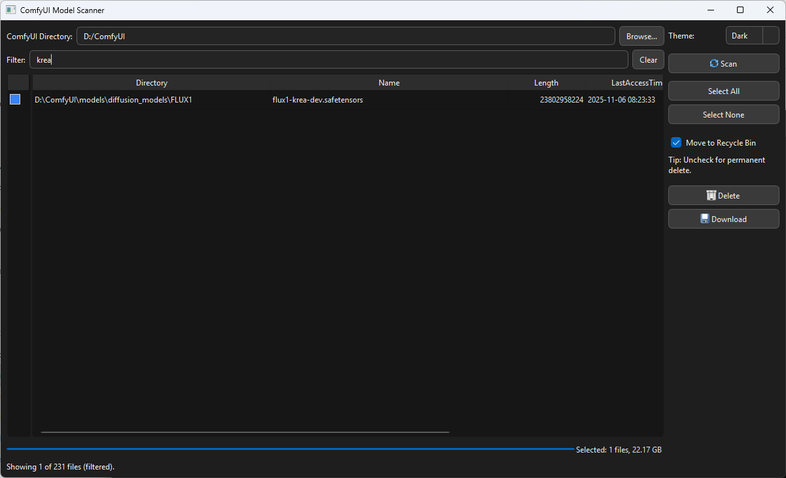
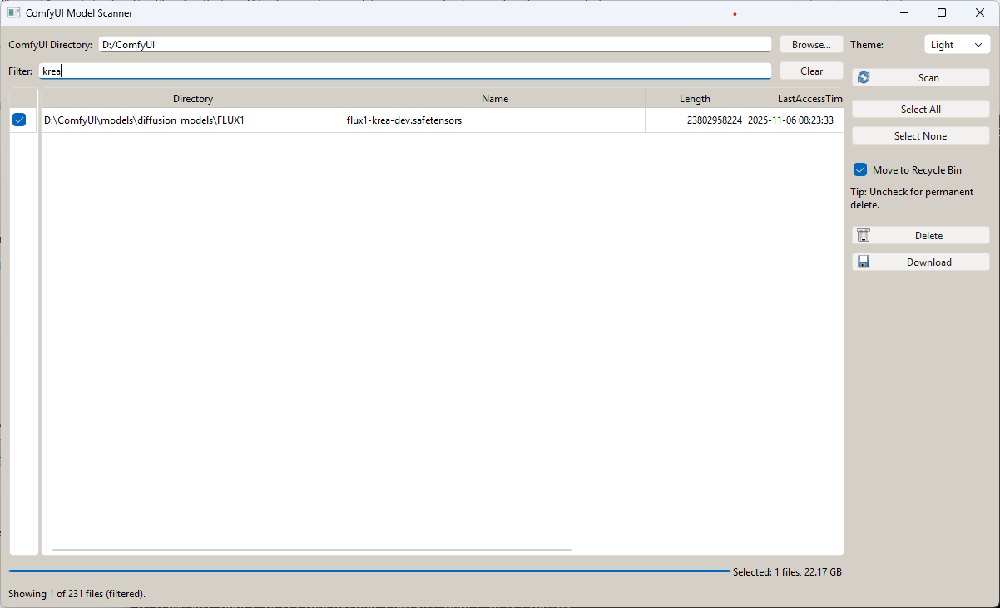

# ComfyUI Model Management

A polished **Windows desktop GUI** built with **PyQt6** to scan, sort, export, and delete ComfyUI model files.

It scans your ComfyUI folder (and subfolders) for common model formats, shows results in a sortable grid, lets you filter/search, export to Excel, and delete selected models (Recycle Bin or permanent).

## Features

- Scan folder recursively for:
  - `.safetensors`, `.ckpt`, `.pth`, `.pt`, `.onnx`, `.bin`, `.gguf`
- Frozen checkbox column (always visible while horizontal scrolling)
- Sort by any column with ▲ / ▼ indicator
  - Default sort: **LastAccessTime ascending** (least frequently accessed first)
- Filter box to search by name/path/extension
- Select All / Select None
- Delete selected files:
  - ✅ Move to Recycle Bin (default, uses `send2trash`)
  - ✅ Permanent delete (toggle off)
- Export visible grid results to `.xlsx` (Excel)
  - Opens Excel automatically if available (`pywin32` / COM)
- Contextual progress bar:
  - Scan progress
  - Delete progress
  - Selection summary (count + total size)
- Light / Dark theme switch (readable buttons + dropdown)
- Remembers settings:
  - ComfyUI folder path
  - Theme
  - Last sorted column + direction

## Screenshots

```md


```

## Quick Start

### Clone the repository

```bash
git clone https://github.com/Rhovanx/comfyui-model-management.git
cd comfyui-model-management
```

### (Optional) Use a virtual environment

```bash 
python -m venv .venv
.\.venv\Scripts\activate
```

### Install dependencies

```bash 
pip install -r requirements.txt
```


## Usage

Run:

```bash
python src/comfyui_model_management.py
```

## Notes

- **Recycle Bin delete** requires:
  - `send2trash`
- **Open Excel after export** requires:
  - Microsoft Excel installed
  - `pywin32`

If Excel isn’t available, the export still works and the app won’t do anything extra.

---

## Build a Windows .exe (PyInstaller)

### 1) Install PyInstaller

Inside your venv:

```bash
pip install pyinstaller
```

### 2) Build (one-file exe)

From the repo root:

```bash
pyinstaller --noconfirm --clean --onefile --windowed ^
  --name "ComfyUI-Model-Management" ^
  src\comfyui_model_management.py
```

Your exe will be in:

- `dist\ComfyUI-Model-Management.exe`

### 3) Recommended build (folder / faster startup)

```bash
pyinstaller --noconfirm --clean --windowed ^
  --name "ComfyUI-Model-Management" ^
  src\comfyui_model_management.py
```

This produces a folder in `dist\ComfyUI-Model-Management\` which usually starts faster than `--onefile`.

### 4) Common PyInstaller tips (PyQt6)

If you hit missing Qt plugin errors, rebuild with explicit Qt collection:

```bash
pyinstaller --noconfirm --clean --onefile --windowed ^
  --name "ComfyUI-Model-Management" ^
  --collect-all PyQt6 ^
  src\comfyui_model_management.py
```

### 5) Optional: icon

Put an `.ico` at `assets\icon.ico` and build with:

```bash
pyinstaller --noconfirm --clean --onefile --windowed ^
  --icon assets\icon.ico ^
  --name "ComfyUI-Model-Management" ^
  src\comfyui_model_management.py
```

## License

MIT
